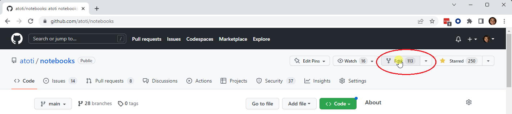

We welcome any contributions from the community. 

## Getting started

To get started, please proceed to 

1. [fork](https://docs.github.com/en/get-started/quickstart/fork-a-repo) the atoti repository:



2. Pull the `main` branch (`git checkout main` and `git pull`) from the forked repository.
3. Run `poetry install` to be sure to work with the expected dependencies.
4. Create the working branch `git switch -c <PSEUDO>/<SUBJECT>`.
5. Start JupyterLab `poetry run jupyter lab`.
6. Create the folder and notebooks.
    Add notebooks responsible for data pre-processing to the [list of untested notebooks](tests/execute_notebooks.py).
    The main notebook using atoti should be tested to ensure users can run them.
7. If a dependency is missing run `poetry add <DEPENDENCY_NAME>`: **DEPENDENCIES MUST NOT BEEN ADDED WITH CONDA OR PIP** since the Github CI is relying on the `poetry.lock` file to install dependencies.
8. Commit and push changes to the forked repository using `git push`.
9. Create a [pull request](https://docs.github.com/en/pull-requests/collaborating-with-pull-requests/proposing-changes-to-your-work-with-pull-requests/about-pull-requests) from the forked repository. 

Please monitor the pull request as each pull request is subjected to automatic code testing. In addition, the atoti team will review and comment on the pull request to ensure the submission is align with the API's usage.


## Pull Request Rules
Please make sure your PR follows the rules below:

### General notebook rules

- folders and files name should be lowercase with hyphen.

  Example: `name-of-my-folder-or-file`

- notebook example should be put inside a folder which name is the notebook's title. This folder should be located under a specific "domain" folder.

  Example: `/relevant-domain/title-of-my-notebook-folder/`

- entrypoint should be named `main.ipynb`
- README TOC should be updated to link to the new notebook
- notebook should have an H1 title, matching folder name and README TOC
- create a README at notebook level to briefly introduce yourself and the use case.

### Data rules

- data files name should use snake_case
- data files should be of reasonnable size, not exceeding 50MB, unless programmatically generated
- all data files should be uploaded on data.atoti.io If you don't have access to it, data should be hosted on a public host and an owner will transfer them to data.atoti.io upon review

### Python code rules

- variables should follow Google's [naming convention](http://google.github.io/styleguide/pyguide.html#316-naming)
- python files should be formatted with [Black](https://black.readthedocs.io/en/stable/)
- python methods should be typed
- documentation should follow Google's [docstring](http://google.github.io/styleguide/pyguide.html#381-docstrings)

### Testing and CI

This repository is tested with a [Github Action](.github/workflows/test.yaml).

These commands can be used while developing:

- Reformat python files using black :

  ```bash
  poetry run black .
  ```

- Reformat notebooks using black-nb :

  ```bash
  poetry run black-nb notebooks/
  ```

- Execute all the notebooks:

  ```bash
  poetry run python tests/execute_notebooks.py
  ```


### About

Checkout [atoti.io](https://www.atoti.io) for more info!

By opening an issue or a pull request, you agree with atoti's [terms of use](https://www.atoti.io/terms) and [privacy policy](https://www.atoti.io/privacy-policy).
