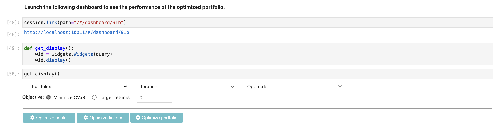
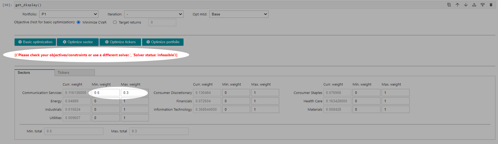
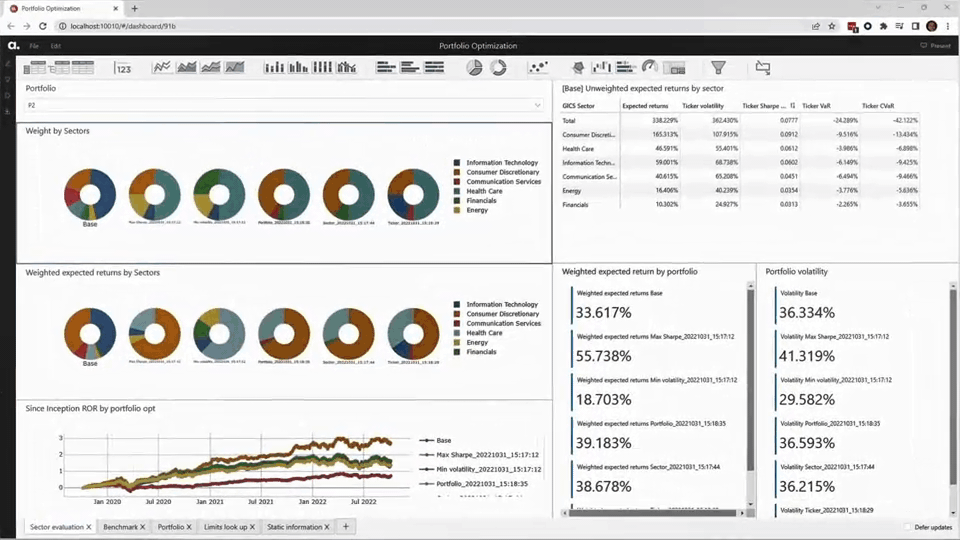

# Running portfolio optimization with constraints in atoti

In the [cvar-optimizer use case](https://github.com/atoti/notebooks/blob/main/notebooks/01-use-cases/finance/portfolio-management/cvar-optimizer/main.ipynb), we integrated the Python library, [PyPortfolioOpt](https://pyportfolioopt.readthedocs.io/en/latest/index.html) into [atoti](https://www.atoti.io/) to perform portfolio optimization analysis within one single platform.

In this use case, we advanced the use case to introduce:
1. the ability to apply weight constraints on sector and/or tickers
2. the ability to choose to minimize CVaR or to achieve a target return
3. the ability to benchmark iterations of optimization against one another (in the previous use case, we benchmarked the portfolio against the initial portfolio).  

 

---

## Running atoti BI analytics platform 

Run [main.ipynb](./main.ipynb) before accessing the web application.
  
 

### (1) Optimize tickers by sector

To perform optimization of tickers by sector, access the following dashboard:
- http://localhost:10010/#/dashboard/768

Under section __7.1 Optimizing within a sector__, select the sector to be optimized.

  

Two sets of weights will be returned by the optimizer based on the following algorithms:
- minimum volatility
- maximum Sharpe

A new portfolio will be created with the new weights for the portfolio.

 

### (2) Optimize portfolio with constraints  

To perform portfolio optimizations with constraints, access the following dashboard:
- http://localhost:10010/#/dashboard/91b

Under section __7.2 Optimizing a portfolio__, select the portfolio to be optimized.  
In case you are unable to see your portfolio, try re-executing cell 50 with `get_display()`.

  

 

__Optimize sector / ticker / portfolio__

1. Select objective of "Minimize CVaR" or achieving "Target returns". Target return is a percentage between 0 and 1. 

2. Set minimum weight and/or maximum weight on sector/ticker where desired. Value should be between 0 and 1.  
When maximum weight is set to 0 for a sector, tickers under the sector will be excluded from the portfolio.  
Similarly, when the maximum weight is set to 0 for a ticker, the ticker will be excluded from the portfolio.  

3. When user click on "Optimize Sector", application only considers the constraints set on the sectors.  
Likewise, for "Optimize tickers", only the constraints set on tickers are considered. Use "Optimize portfolio" to apply constraints from both sectors and tickers.

 

⚠️The application does not stop us from entering insensible values, e.g. min. weight greater than max. weight.  
However, upon optimization, we may encounter feasibility error:

   

 

4. Adjust the constraints until the optimization is successful.

 

Do note that the application however, will default ticker's weight to 0 if the maximum weight of its sector is set to 0.

---

### Review and adjust optimization results  

Interactively review the various business metrics for the portfolio as we optimize the portfolio.  

   

We can retrieve an iteration for tuning and compare the performance of the new portfolio setup against the previous.  

 

<b>Having problem? Reach out to us on [GitHub discussion](https://github.com/atoti/atoti/discussions) or contact [ActiveViam](https://www.activeviam.com/contact-us/) for a demonstration.</b>