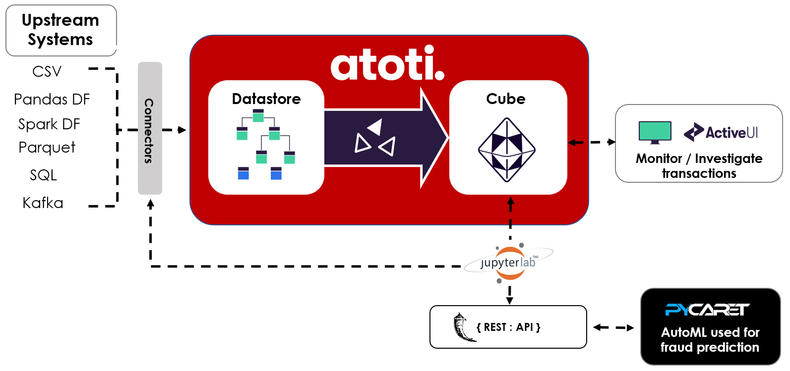

# Real-time Credit Card Fraud Analysis with atoti

This use case comprises of 3 main sections:

- Generation of synthetic data with Faker for Machine Learning and simulate real-time transactions.
- Detect credit card fraud with autoML, choosing the best model with PyCaret.
- Real-time credit card analysis to investigate suspicious transaction flagged by the ML.

Below depicts the flow between the libraries and their usage:  


This use case uses [PyCaret 2.3.4](https://pycaret.org/).  
As the latest version of atoti has conflicting dependencies with PyCaret, the two programs are running on separate virtual environment, communicating through endpoints.

  


## 1 Synthetic data generation

[01-Synthetic-data-generation.ipynb](./01-Synthetic-data-generation.ipynb) is adapted from the GitHub repository [Sparkov_Data_Generation](https://github.com/namebrandon/Sparkov_Data_Generation). It makes use of Faker to generate customers and credit card transactions with varying profiles:

- Fraudulent / Non-fraudulent
- Male / Female
- Age groups ranging from:
  - <= 25
  - 25 - 50
  - \>= 50
- Geographical location
  - urban
  - rural
- Average transaction a day
- Weighted spending habits across:
  - the week
  - time of the year such as holiday or seasons
  - across each quarter of the year
  - time of the day (AM/PM)
- Weighted spending across various expenditure categories

We have generated data from 2021-06-01 till 2021-10-30 and they can be accessible from https://data.atoti.io/notebooks/credit-card-fraud/output.zip.

## 2 AutoML with PyCaret

We tested out two modules from the autoML [PyCaret](https://pycaret.org/) with reference to their tutorials:

- [Binary Classification](https://github.com/pycaret/pycaret/blob/master/tutorials/Binary%20Classification%20Tutorial%20Level%20Beginner%20-%20%20CLF101.ipynb)
- [Anomaly detection](https://github.com/pycaret/pycaret/blob/master/tutorials/Anomaly%20Detection%20Tutorial%20Level%20Beginner%20-%20ANO101.ipynb)

Refer to the notebooks:

- [02-AutoML-PyCaret-anomaly.ipynb](./02-AutoML-PyCaret-anomaly.ipynb)
- [03-AutoML-PyCaret-classification.ipynb](./03-AutoML-PyCaret-classification.ipynb)

Using the data generated by the [synthetic credit card transactions generator](./01-Synthetic-data-generation.ipynb), the trained models are saved under the "model" folder for later use in performing periodic prediction as data is made available. These models are trained on the features listed under `features_list` (i.e. includes the cumulative features.)

Unseen data predictions from these notebooks are saved to [output.zip](https://data.atoti.io/notebooks/credit-card-fraud/output.zip) for quick comparison of model performance in atoti. These includes the prediction from both modules on the full feature list:

- july_aug_prediction_full_lgbm.csv
- july_aug_prediction_full_et.csv
- july_aug_prediction_full_dt.csv
- july_aug_anomalies_full_iforest.csv

And also, unseen data prediction for both modules without cumulative features (models not provided):

- july_aug_prediction_lgbm.csv
- july_aug_prediction_et.csv
- july_aug_prediction_dt.csv
- july_aug_anomalies_iforest.csv

## 3 Real-time credit card fraud detection with atoti

[main.ipynb](./main.ipynb) can be executed independent of the other two notebooks as we have saved both the data and trained models.

This notebook covers the following:

- Loading of the data used for ML modelling in [03-AutoML-PyCaret-classification.ipynb](./03-AutoML-PyCaret-classification.ipynb) into atoti for EDA (exploratory data analysis).
- Create some business metrics in atoti to gather additional insights.
- Evaluate the performance of the _Light Gradient Boosting Machine (LGBM)_ model.
- Simulate real-time transactions by iterating through chunks of data with Pandas DataFrame. In each iteration:
  - we used the LGBM model to perform fraud prediction
  - load transactions and its prediction into atoti
- Evaluate incoming transaction from atoti web application on http://localhost:10327.

### Real-time fraud prediction

To test the real-time fraud detection, start the Flask application included under the `atoti-pycaret` package. Follow the [README.md](./atoti-pycaret/README.md) included under the package on how to start the application.  

Alternatively, you can always integrate your own machine learning models and update the REST URI under the function `get_prediction` in the [main.ipynb](./main.ipynb):

```
def get_prediction(features_df):
    url = "http://127.0.0.1:105/predict"
    header = {"Content-Type": "application/json"}

    payload = {
        "features": features_df.to_json(orient="records"),
    }

    try:
        response = requests.post(url, json=payload)

        prediction = pd.DataFrame.from_dict(response.json())
        return prediction

    except requests.exceptions.HTTPError as e:
        print(e.response.text)
```