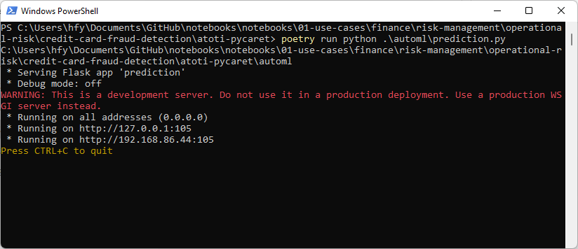
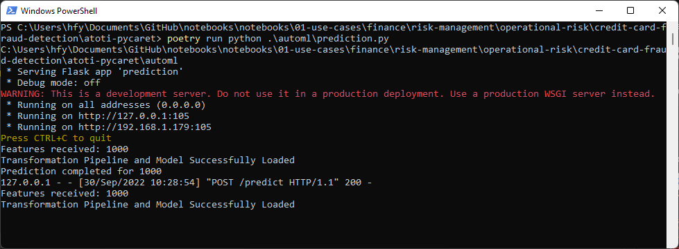

# Endpoint for Credit Card Fraud prediction

The package automl consists of machine learning models that we have trained using [PyCaret](https://pycaret.org/).

By creating a small [Flask application](https://flask.palletsprojects.com/en/2.2.x/), we are able to create an endpoint that takes in the features for the model to perform fraud prediction.

# Installation

If using Poetry in a Windows environment, it is recommended to use Python 3.8 due to llvmlite and numpy requirements for PyCaret:  
`poetry env use $(py -3.8 -c 'import sys; print(sys.executable)')`

Set up the virtual environment for the project using the below command:
```
poetry install
```

Refer to the [poetry documentation](https://python-poetry.org/docs/master/#installing-with-the-official-installer) for more information on the package manager.


# Runtime
To launch the Flask application, run the following command:
```
poetry run python .\automl\prediction.py
```

You should able to see the following:



We can post requests to the endpoint at http://127.0.0.1:105/predict, e.g.  

```
def get_prediction(features_df):
    url = "http://127.0.0.1:105/predict"
    header = {"Content-Type": "application/json"}

    payload = {
        "features": features_df.to_json(orient="records"),
    }

    try:
        response = requests.post(url, json=payload)

        prediction = pd.DataFrame.from_dict(response.json())
        return prediction

    except requests.exceptions.HTTPError as e:
        print(e.response.text)
```

You can verify that the requests are received by the endpoint through the shell running this program:

  


The endpoint returns a Pandas Dataframe containing the features and their corresponding prediction.
